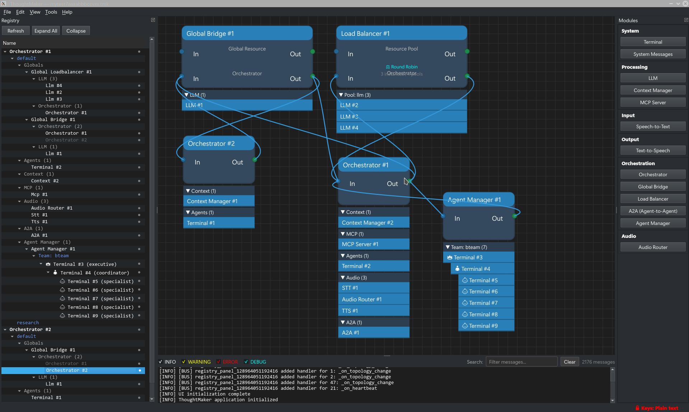

# ThoughtMaker

A visual node-based programming environment with LLM integration, featuring a decentralized message bus architecture for building AI-powered workflows.

*Docked view with expanded module hierarchy*

## Features

- **Visual Node-Based Interface**: Drag-and-drop modules on a canvas to build workflows
- **Decentralized Message Bus**: Asynchronous message routing without a central coordinator
- **LLM Integration**: Support for multiple providers (Anthropic, OpenAI, Mistral, Ollama, local models)
- **Orchestration**: Local orchestrators act as switches for connected modules
- **Context Management**: Prompt enrichment and context library support
- **Agent Teams**: Hierarchical agent management with executive, coordinator, and specialist roles

## Architecture

- **Modules**: Terminal, LLM, Context Manager, Orchestrator, Global Bridge, Load Balancer, and more
- **Event Bus**: High-performance asyncio-based message handling
- **Visual Canvas**: PyQt5-based interface with registry panel for managing complex workflows
- **Audio Support**: Speech-to-text and text-to-speech integration

---

Copyright 2024 - 2026 Skylark Software LLC. All rights reserved.
